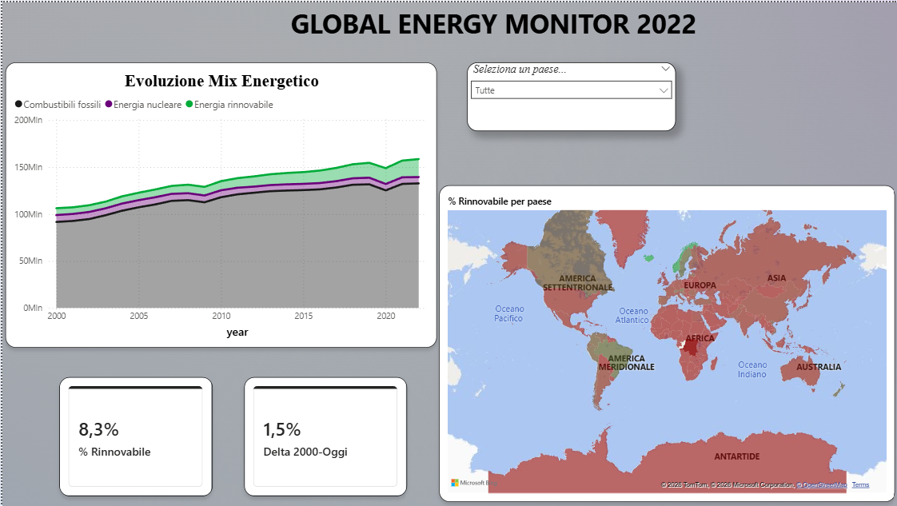

# Global Energy Monitor Dashboard

### Descrizione del Progetto
Analisi dei trend energetici globali dal 2000 al 2022. L'obiettivo è monitorare la transizione dalle fonti fossili alle rinnovabili attraverso l'analisi di un dataset di oltre 200.000 record.

### Anteprima Dashboard

### Tecnologie Utilizzate
* **SQL (PostgreSQL):** Pulizia dati, JOIN, CTE e aggregazioni complesse (vedi file `analisi_energia.sql`).
* **Power BI:** Data Modeling (Star Schema), Misure DAX avanzate e Dashboard interattiva (vedi file `.pbix`).
* **Dati:** Dataset Open Source sui consumi energetici globali.

### Obiettivi dell'Analisi
1. Analizzare l'evoluzione del mix energetico per ogni nazione.
2. Calcolare il Delta di crescita delle rinnovabili rispetto al 2000.
3. Identificare i paesi leader nella transizione ecologica.

---
*Progetto realizzato da Francesca Pia Dimeo*
